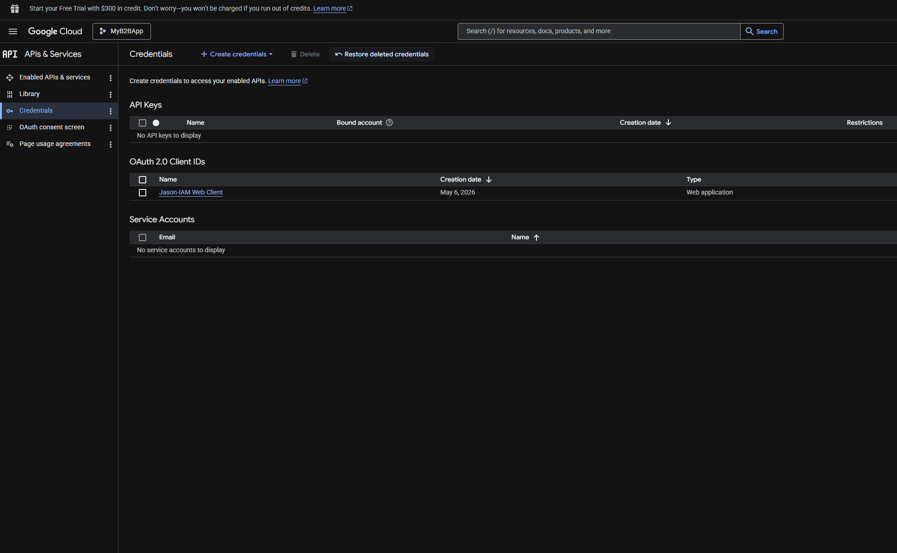
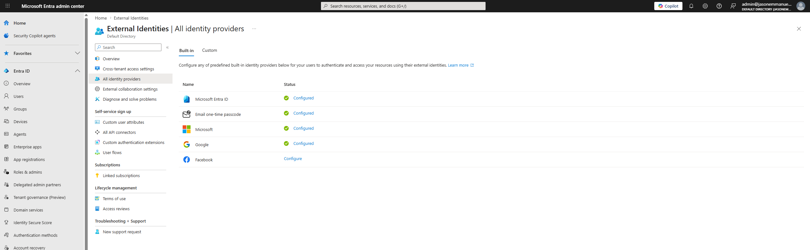
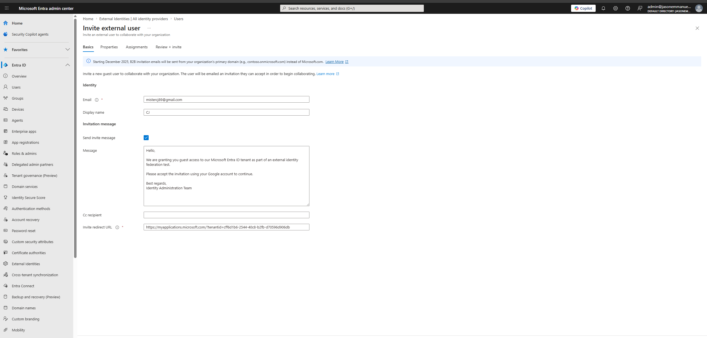
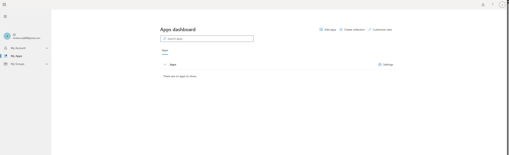

# Project – External Identity Federation with Google OAuth and Microsoft Entra ID

---

## Overview

This project demonstrates external identity federation between **Google OAuth 2.0** and **Microsoft Entra ID** using External Identities.

The objective was to configure Google as a federated identity provider inside Microsoft Entra ID, invite an external Gmail user as a guest account, and validate external authentication behavior.

This simulates real-world B2B federation scenarios where organizations allow external users to authenticate using trusted third-party identity providers instead of requiring separate Microsoft-managed credentials.

---

## Environment

| Tool | Purpose |
|------|---------|
| Microsoft Entra ID | External identity federation |
| Google Cloud Console | OAuth application configuration |
| Google OAuth 2.0 | Federated authentication provider |
| Microsoft External Identities | B2B collaboration |
| Gmail | External guest identity |
| GitHub | Documentation and evidence tracking |

---

## Google OAuth Application Configuration

### Scenario

A Google OAuth application was created to establish trust between Google identity services and Microsoft Entra ID.

This allows external Gmail users to authenticate using Google credentials during Microsoft Entra B2B collaboration workflows.

### Actions Taken

1. Created a Google Cloud project named **MyB2BApp**
2. Configured OAuth Consent Screen settings
3. Created a Web Application OAuth client
4. Added Microsoft redirect URIs
5. Generated OAuth Client ID and Client Secret
6. Added authorized domains and test users

### Principle Applied

Federated identity allows organizations to trust external identity providers while reducing the need for separate credential management.

*Google Cloud Console showing OAuth 2.0 client configuration for Microsoft Entra federation*

---

## Microsoft Entra External Identity Provider Configuration

### Scenario

Google federation was configured inside Microsoft Entra ID using the OAuth Client ID and Client Secret generated in Google Cloud.

This established Google as a trusted external identity provider for B2B collaboration.

### Actions Taken

1. Navigated to External Identities in Microsoft Entra ID
2. Opened All Identity Providers
3. Added Google as an external identity provider
4. Configured OAuth Client ID and Client Secret
5. Saved federation configuration successfully

### Principle Applied

External identity federation centralizes authentication trust while allowing external users to maintain their existing credentials.

*Microsoft Entra ID configured with Google as an external identity provider*

---

## External Guest Invitation Workflow

### Scenario

An external Gmail account was invited into Microsoft Entra ID as a guest user for B2B collaboration testing.

The invitation workflow simulated external partner onboarding into a federated tenant environment.

### Actions Taken

1. Opened Invite External User workflow
2. Added external Gmail address
3. Customized invitation message
4. Generated invitation redirect URL
5. Submitted guest invitation request

### Principle Applied

B2B guest onboarding enables secure collaboration with external identities without creating internal employee accounts.

*Microsoft Entra ID external guest invitation workflow configured for Gmail federation testing*

---

## Federation Authentication Validation

### Scenario

Federation behavior was tested using the external Gmail identity.

The objective was to validate whether the Gmail account could authenticate directly through Google without requiring separate Microsoft-managed verification steps.

### Actions Taken

1. Opened authentication flow using the Gmail test account
2. Verified Google authentication redirection
3. Tested external identity access behavior
4. Validated successful sign-in into Microsoft applications dashboard

### Principle Applied

Federated authentication reduces credential duplication by allowing users to authenticate through trusted external identity providers.

### Observations

The external Gmail account successfully authenticated into the Microsoft application environment using Google federation.

However, invitation email delivery behavior appeared inconsistent during testing. This may be related to limitations of free-tier or non-enterprise tenant configurations commonly seen in Microsoft Entra lab environments.

Despite this limitation, federation configuration and external identity authentication behavior were successfully validated.

*External Gmail account authenticated into Microsoft applications environment through Google federation*

---

## Skills Demonstrated

| Skill | How It Was Applied |
|------|--------------------|
| External Identity Federation | Configured Google as federated identity provider |
| OAuth 2.0 Configuration | Created OAuth client application in Google Cloud |
| B2B Collaboration | Invited external guest users into Microsoft Entra ID |
| Identity Provider Integration | Connected Google OAuth with Microsoft Entra |
| Redirect URI Configuration | Configured secure OAuth redirect endpoints |
| Guest User Management | Created external collaboration workflow |
| Federation Validation | Tested external authentication behavior |
| IAM Documentation | Captured screenshots and documented federation workflow |

---

## Lessons Learned

**Federation reduces credential fragmentation.**  
Allowing external users to authenticate through trusted identity providers simplifies collaboration and reduces password management overhead.

**OAuth configuration requires precision.**  
Redirect URIs and authorized domains must match exactly between providers or authentication workflows fail.

**External identity providers improve user experience.**  
Federated sign-in removes the need for external users to maintain separate Microsoft-managed credentials.

**Lab environments can behave differently than enterprise tenants.**  
During testing, invitation email delivery appeared inconsistent, likely due to free-tier tenant limitations or non-production federation constraints commonly seen in lab environments.

---

## References

- Google Cloud Console  
https://console.developers.google.com

- Microsoft Entra External Identities Documentation  
https://learn.microsoft.com/en-us/entra/external-id/

- Microsoft Entra B2B Collaboration  
https://learn.microsoft.com/en-us/entra/external-id/what-is-b2b

- Google OAuth 2.0 Documentation  
https://developers.google.com/identity/protocols/oauth2
